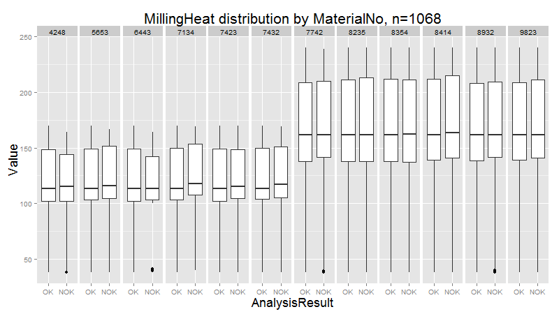
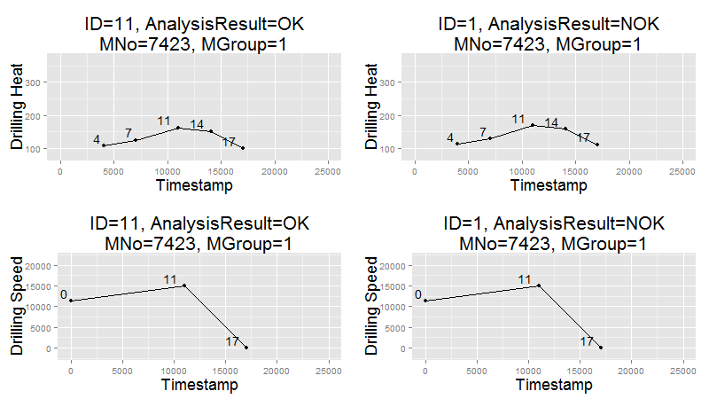

# kronos
Repository for the Summer School in Canada project (6th semester)

# Table of contents

# Directories
* __/data/__ Stores partly aggregated event data for a finished 
  product in a SQLite database
* __/http/__ Directory used to statically serve files via an http server
* __/lib/__ Stores .jar files for libraries not in Maven
* __/log/__ Stores .log files that are logged via Log4J
* __/R/__
* __/res/__ Stores resource files
* __/sim/__ Directory for the simulation .jar, documentation and batch file to start
the simulation
* __/src/__ Java files
* __/target/__ Binary compiled Java files

# Java Project
The Java-project is devided into 6 big Parts:
* [Collect data](#collect)
* [Create objects] (#create) 
* [Product state] (#product)
* [WebSocket-Server] (#ws)
* [Database] (#db)
* [HTTP-Server] (#http)

The Main-class starts the simulation and a ConnectionHandler to collect the data from the event-stream as well as the HTTP- and the WebSocket-Server.

## <a name="collect">Collect data</a>
To collect the data from the simulation, the connectionHandler starts 3 Listeners that run in different Threads. Two of them are MessageListeners which use a MessageConsumer to read the ERP- and OPC-Data from the event-stream. The Third one uses a FileWatcher, that gets notified when a new file is created with the Spectral-Analysis-data. All 3 Listeners are Observable and give the JSON/XML-String to the Observer.
The Observer is a MessageHandler, which writes the events into a queue, to be processed further.

## <a name="create">Create objects</a>
The queue is processeD by a MessageWorker, which is also a Thread and constantly looks in the queue for new messages. After getting a message, the worker reads the type of the message and calls a factory which unmarshalls the data into a java-object, depending on the type. (ERPItem, OPCItem, SAItem)

## <a name="product">Product state</a>
After the objects are created, the MessageWorker passes them to the ProductHandler. If the object is an ERPItem a new product-object is created. Every product contains a state-machine which observes the current state of the product. If the object given to the ProductHandler is an OPCItem or a SAItem the ProductHandler loops over every active product and tries to assign the event to product. This is evaluated with the current state of the product and the trigger which is connected to the Item.

After the event is connected to a product it is given to the WebSocket-Server and the Database.

## <a name="ws">WebSocket-Server</a>
The WebSocket-Server takes the events, creates a MessageObject, which is then converted to JSON and send to a client, which is connected to the WebSocket.

## <a name="db">Database</a>
After a product is finished (after the spectral-analysis), the data which is contained in each product is stored in an SQLite-database.

## <a name="http">HTTP-Server</a>
The HTTP-Server takes aggregated data out of the database and exposes this data in an REST-API.


# Analysis results
Data was saved in a SQLite database. It was then analyzed and visualized with R. We analyzed 
three different variables containing information about a product: The customer (`CustomerNo`),
the material type (`MaterialNo`) and the result of the spectral analysis (`AnalysisResult`) 
carried out at the end of the production line.

* There are 8 customers
* There are 12 types of materials
* The result of the spectral analysis can be `OK` or `Not OK`

## Customer
First, we analyzed information about products aggregating by customers. The following graphs
shows that each customer orders a similar number of products and that the ratio of `OK` to `NOK`
products is alike. 

As such the spectral analysis result is __not__ dependant on the customer.


### MaterialNumber
#### Werteverteilungen (Boxplots): Als 1. Beweis für Materialgruppen
##### Milling Heat


##### Drilling Heat


#### Clusteranalyse: Als 2. Beweis für Materialgruppen


#### "Milling" Prozess: 3. Unterschiedliche Prozesse je Materialgruppe

#### "Drilling" Prozess: 4. ""


## AnalysisResult: Keine Vorhersage möglich?
### Vergleich zwischen "OK" und "NOK" in selber MatNo
#### "Milling" Prozess

#### "Drilling" Prozess


### Diskriminanzanalyse


# Sample sim data
m_orders
```
<?xml version="1.0" encoding="UTF-8" standalone="yes"?>
<erpData>
    <customerNumber>4716</customerNumber>
    <materialNumber>9823</materialNumber>
    <orderNumber>f747ec21-1928-436e-b2f3-504ca33c551f</orderNumber>
    <timeStamp>2015-07-15T13:33:56.665-04:00</timeStamp>
</erpData>
```

m_opcitems
```
<?xml version="1.0" encoding="UTF-8" standalone="yes"?>
<OpcDataItem>
    <itemName>Lichtschranke 1</itemName>
    <status>GOOD</status>
    <timestamp>1436981636743</timestamp>
    <value xsi:type="xs:boolean" xmlns:xs="http://www.w3.org/2001/XMLSchema" 
    xmlns:xsi="http://www.w3.org/2001/XMLSchema-instance">false</value>
</OpcDataItem>
```

JSON file
```
{
	"em1":82.84782409018561,
	"em2":92.55025258144875,
	"a1":90.68883374006916,
	"a2":38.089310170829044,
	"b2":3525.1752769633727,
	"b1":7513.372544641339,
	"overallStatus":"NOK",
	"ts_start":1436978781258,
	"ts_stop":1436978792262
}
```

# Finite State Machine

To track the current position of a product a Finite State machine is used. 

The finite State machine has following states:
- INIT
- LIGHTBARRIER_1,
- BETWEEN_L1_L2,
- LIGHTBARRIER_2,
- BETWEEN_L2_L3,
- MILLING_STATION,
- BETWEEN_L3_L4,
- DRILLING_STATION,
- BETWEEN_L4_L5,
- LIGHTBARRIER_5,
- END_OF_PRODUCTION,
- SPECTRAL_ANALYSIS,
- FINISH

with following triggers:
- LIGHTBARRIER_1_INTERRUPT
- LIGHTBARRIER_1_CONNECT
- LIGHTBARRIER_2_INTERRUPT
- LIGHTBARRIER_2_CONNECT
- LIGHTBARRIER_3_INTERRUPT
- MILLING_STATION
- LIGHTBARRIER_3_CONNECT
- LIGHTBARRIER_4_INTERRUPT
- DRILLING_STATION
- LIGHTBARRIER_4_CONNECT
- LIGHTBARRIER_5_INTERRUPT
- LIGHTBARRIER_5_CONNECT
- SPECTRAL_ANALYSIS

The product takes following path:

