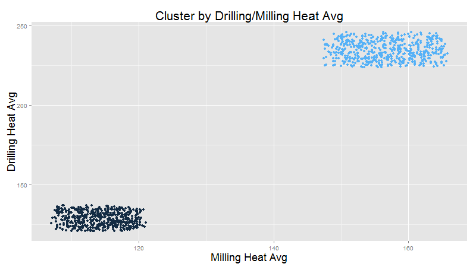

# kronos
Repository for the Summer School in Canada project (6th semester)

# Table of contents

# Directories
* __/data/__ Stores partly aggregated event data for a finished 
  product in a SQLite database
* __/http/__ Directory used to statically serve files via an http server
* __/lib/__ Stores .jar files for libraries not in Maven
* __/log/__ Stores .log files that are logged via Log4J
* __/R/__
* __/res/__ Stores resource files
* __/sim/__ Directory for the simulation .jar, documentation and batch file to start
the simulation
* __/src/__ Java files
* __/target/__ Binary compiled Java files


# Analyseergebnisse
Die Daten wurden in Form einer SQLite Datenbank abgespeichert und anschließend mit R
analysiert.

## Metadaten

### Materialnummern
#### N Produkte je Kunde und Ausschussrate


#### Werteverteilungen (Boxplots): Als 1. Beweis für Materialgruppen
##### Milling Heat


##### Drilling Heat


#### Clusteranalyse: Als 2. Beweis für Materialgruppen


#### "Milling" Prozess: 3. Unterschiedliche Prozesse je Materialgruppe

#### "Drilling" Prozess: 4. ""


## AnalysisResult: Keine Vorhersage möglich?
### Vergleich zwischen "OK" und "NOK" in selber MatNo
#### "Milling" Prozess

#### "Drilling" Prozess


### Diskriminanzanalyse


# Sample sim data
m_orders
```
<?xml version="1.0" encoding="UTF-8" standalone="yes"?>
<erpData>
    <customerNumber>4716</customerNumber>
    <materialNumber>9823</materialNumber>
    <orderNumber>f747ec21-1928-436e-b2f3-504ca33c551f</orderNumber>
    <timeStamp>2015-07-15T13:33:56.665-04:00</timeStamp>
</erpData>
```

m_opcitems
```
<?xml version="1.0" encoding="UTF-8" standalone="yes"?>
<OpcDataItem>
    <itemName>Lichtschranke 1</itemName>
    <status>GOOD</status>
    <timestamp>1436981636743</timestamp>
    <value xsi:type="xs:boolean" xmlns:xs="http://www.w3.org/2001/XMLSchema" 
    xmlns:xsi="http://www.w3.org/2001/XMLSchema-instance">false</value>
</OpcDataItem>
```

JSON file
```
{
	"em1":82.84782409018561,
	"em2":92.55025258144875,
	"a1":90.68883374006916,
	"a2":38.089310170829044,
	"b2":3525.1752769633727,
	"b1":7513.372544641339,
	"overallStatus":"NOK",
	"ts_start":1436978781258,
	"ts_stop":1436978792262
}
```

# Finite State Machine

To track the current position of a product a Finite State machine is used. 

The finite State machine has following states:
- INIT
- LIGHTBARRIER_1,
- BETWEEN_L1_L2,
- LIGHTBARRIER_2,
- BETWEEN_L2_L3,
- MILLING_STATION,
- BETWEEN_L3_L4,
- DRILLING_STATION,
- BETWEEN_L4_L5,
- LIGHTBARRIER_5,
- END_OF_PRODUCTION,
- SPECTRAL_ANALYSIS,
- FINISH

with following triggers:
- LIGHTBARRIER_1_INTERRUPT
- LIGHTBARRIER_1_CONNECT
- LIGHTBARRIER_2_INTERRUPT
- LIGHTBARRIER_2_CONNECT
- LIGHTBARRIER_3_INTERRUPT
- MILLING_STATION
- LIGHTBARRIER_3_CONNECT
- LIGHTBARRIER_4_INTERRUPT
- DRILLING_STATION
- LIGHTBARRIER_4_CONNECT
- LIGHTBARRIER_5_INTERRUPT
- LIGHTBARRIER_5_CONNECT
- SPECTRAL_ANALYSIS

The product takes following path:

