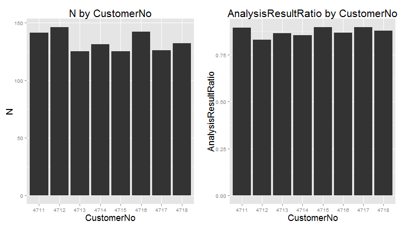
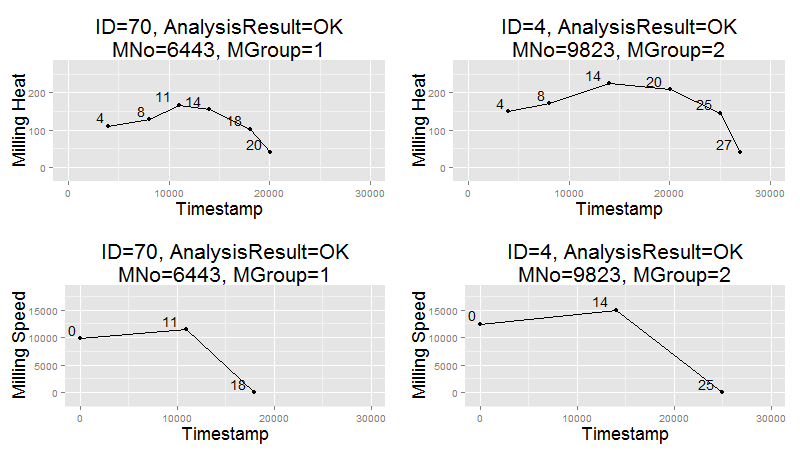
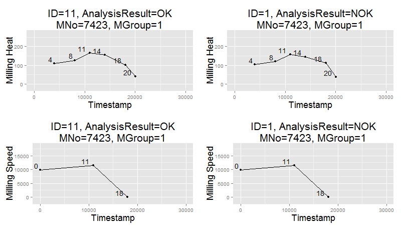

# kronos
Repository for the Summer School in Canada project (6th semester)

# Table of contents

# Directories
* __/data/__ Stores partly aggregated event data for a finished 
  product in a SQLite database
* __/http/__ Directory used to statically serve files via an http server
* __/lib/__ Stores .jar files for libraries not in Maven
* __/log/__ Stores .log files that are logged via Log4J
* __/R/__
* __/res/__ Stores resource files
* __/sim/__ Directory for the simulation .jar, documentation and batch file to start
the simulation
* __/src/__ Java files
* __/target/__ Binary compiled Java files

# Java Project
The Java-project is devided into 6 big Parts:
* Collect data
* Create objects 
* Product state
* WebSocket-Server
* HTTP-Server
* Database

The Main-class starts the simulation and a ConnectionHandler to collect the data from the eventstream as well as the HTTP- and the WebSocket-Server.

## Collect data
To collect the data from the simulation, the connectionHandler starts 3 Listeners that run in different Threads. Two of them are MessageListeners which use a MessageConsumer to read the ERP- and OPC-Data from the eventstream. The Third one uses a Filewatcher, that gets notified when a new File is created with the Spectral-Analysis-data. All 3 Listeners are Observable and give the JSON/XML-String to the Observer.
The Observer is a Message, which writes the Events into a queue, to be processed further.

## Create objects
The queue is processes by a MessageWorker, which is a Thread and constantly takes an object out of the queue. After gettig a message, the worker reads the type of the message and calls a factory which unmarshalls the data into a java-object, depending on the type. (ERPItem, OPCItem, SAItem)

# Analysis results
Data was saved in a SQLite database. It was then analyzed and visualized with R. We analyzed 
three different variables containing information about a product: The customer (`CustomerNo`),
the material type (`MaterialNo`) and the result of the spectral analysis (`AnalysisResult`) 
carried out at the end of the production line.

* There are 8 customers
* There are 12 types of materials
* The result of the spectral analysis can be `OK` or `Not OK`

## Customer
First, we analyzed information about products aggregating by customers. The following graphs
shows that each customer orders a similar number of products and that the ratio of `OK` to `NOK`
products is alike. 

As such the spectral analysis result is __not__ dependant on the customer.


## Material type
Next, we analyzed product data grouping by the type of material (`MaterialNo`) used. There are 
12 different types. Here we start to see several differences in the data depending on the type of
material used. 

### Value distributions of Drilling and Milling Heat
First, we aggregated data from the `Milling` and `Drilling` processes by calculating the average
Milling and Drilling Heat per product. After this we grouped the data by material type. The following 
graphs show the value distributions of the averages per material type:

These graphs show that it __might__ be possible to split the 12 material types into 2 material groups, 
each consisting of 6 types.

##### Milling Heat


##### Drilling Heat


### Cluster analysis to further show 2 groups of material types
The scatter plot shows two clusters of average Milling and Drilling Heat, giving
further evidence of 2 groups of material types.


### Spectral analysis result by material type
Next, we aggregated the result of the spectral analysis by the material type. The number
of products produced per material types seems to be insignificant. Assuming two different 
groups of material types, however, leads to evidence of __worse__ analysis results for the second 
group of material types.


### Milling and Drilling processes
To confirm our assumption of two different material groups we looked further into the `Milling` 
and `Drilling` processes. These show the following (per product):

* 6 values measured for `Heat`
* 3 values measured for `Drilling`
* The 2nd group of material types show higher `Speed` and `Heat` values, for `Milling` as
well as `Drilling`
* The 2nd group of material types show __longer__ processes

The following graphs show two exemplary products, each in a different material group:

##### Milling process

##### Drilling process


## Spectral analysis result
Lastly, we tried to predict the result of the spectral analysis at the end of the production
line by analyzing `Milling` and `Drilling` processes. First, we compare two products with the
same material type, one of which is `OK` while the other is `Not OK`. 

The following graphs show that the spectral analysis result is __not__ dependant on the values
measured during the processes, because both products show very similar values.

##### Milling process

##### Drilling process


### Discriminant analysis
To confirm the result above we tried using a discriminant analysis. We generated one function
by taking into account the standardized average of Milling and Drilling Heat values per product.
The following graph shows the result of filtering by a single material type.

As such we could __not__ predict the spectral analysis result by using a discriminant analysis,
because the distribution for `OK` and `Not OK` products is very similar for the function.


## Conclusion
Taking into account the analysis above, we were able to make the following assumptions:

* The type of material used and the result of the spectral analysis is __not__ dependant on 
the customer 
* The 12 material types are split into 2 material groups
* Each material group shows different `Milling` and `Drilling` processes
* Each material group shows different ratios of the spectral analysis
* The spectral analysis result is not dependant on heat values from the two processes


# Sample sim data
m_orders
```
<?xml version="1.0" encoding="UTF-8" standalone="yes"?>
<erpData>
    <customerNumber>4716</customerNumber>
    <materialNumber>9823</materialNumber>
    <orderNumber>f747ec21-1928-436e-b2f3-504ca33c551f</orderNumber>
    <timeStamp>2015-07-15T13:33:56.665-04:00</timeStamp>
</erpData>
```

m_opcitems
```
<?xml version="1.0" encoding="UTF-8" standalone="yes"?>
<OpcDataItem>
    <itemName>Lichtschranke 1</itemName>
    <status>GOOD</status>
    <timestamp>1436981636743</timestamp>
    <value xsi:type="xs:boolean" xmlns:xs="http://www.w3.org/2001/XMLSchema" 
    xmlns:xsi="http://www.w3.org/2001/XMLSchema-instance">false</value>
</OpcDataItem>
```

JSON file
```
{
	"em1":82.84782409018561,
	"em2":92.55025258144875,
	"a1":90.68883374006916,
	"a2":38.089310170829044,
	"b2":3525.1752769633727,
	"b1":7513.372544641339,
	"overallStatus":"NOK",
	"ts_start":1436978781258,
	"ts_stop":1436978792262
}
```

# Finite State Machine

To track the current position of a product a Finite State machine is used. 

The finite State machine has following states:
- INIT
- LIGHTBARRIER_1,
- BETWEEN_L1_L2,
- LIGHTBARRIER_2,
- BETWEEN_L2_L3,
- MILLING_STATION,
- BETWEEN_L3_L4,
- DRILLING_STATION,
- BETWEEN_L4_L5,
- LIGHTBARRIER_5,
- END_OF_PRODUCTION,
- SPECTRAL_ANALYSIS,
- FINISH

with following triggers:
- LIGHTBARRIER_1_INTERRUPT
- LIGHTBARRIER_1_CONNECT
- LIGHTBARRIER_2_INTERRUPT
- LIGHTBARRIER_2_CONNECT
- LIGHTBARRIER_3_INTERRUPT
- MILLING_STATION
- LIGHTBARRIER_3_CONNECT
- LIGHTBARRIER_4_INTERRUPT
- DRILLING_STATION
- LIGHTBARRIER_4_CONNECT
- LIGHTBARRIER_5_INTERRUPT
- LIGHTBARRIER_5_CONNECT
- SPECTRAL_ANALYSIS

The product takes following path:

